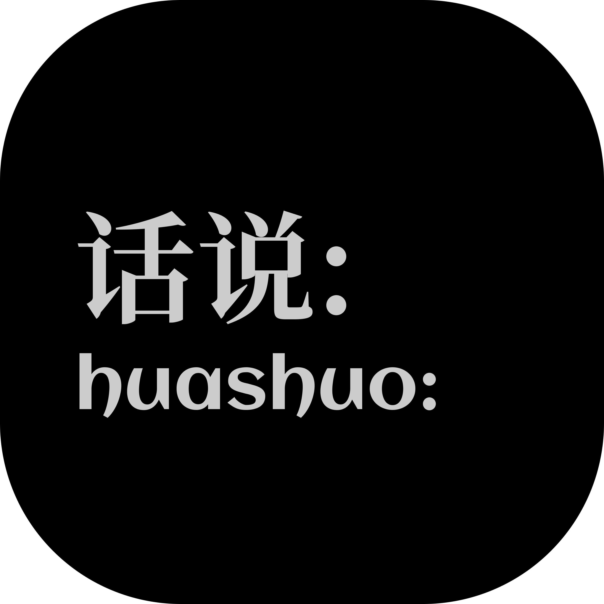

<p align="center">
  <picture>
    <source media="(prefers-color-scheme: dark)" srcset="docs/assets/huashuo-logo-white.png">
    
  </picture>
</p>

<h1 align="center">话说 Huashuo</h1>

<p align="center">在 Mac 电脑上制作多角色有声书</p>

<p align="center">
  <a href="https://github.com/wixette/huashuo/actions/workflows/tests.yml"></a>
  <a href="LICENSE"></a>
  <a href="https://github.com/wixette/huashuo/releases"></a>
</p>

<p align="center">简体中文 | <a href="README.en.md">English</a></p>

话说（Huashuo）把中文小说（TXT、EPUB）做成多角色有声书：先由 LLM 找出每句对白是谁说的，再按角色的性别、年龄和性格为每个人挑一个合适的声音，用 Qwen3-TTS 在 Mac 本机合成语音，最后生成带章节、封面的 M4B 有声书，可以直接在 Apple Books 里收听。语音合成完全在本机进行；LLM 可以用云端服务，也可以用本机运行的模型，做到零费用。当前是预发布版 0.1.0a1。

> Huashuo turns Chinese novels (TXT / EPUB) into multi-voice M4B audiobooks on an Apple
> Silicon Mac: an LLM finds who says each line, and Qwen3-TTS reads every character in a
> fitting voice, locally. Pre-release 0.1.0a1. [English README →](README.en.md)

## 试听

GitHub 的播放器默认静音，播放时请打开声音。

**《广告》**（半轻人，全文 6 分钟）：11 个说话的角色，每人一种不同的声音。

https://github.com/user-attachments/assets/46a00a20-8378-4aa3-97c8-bdf618f45e63

**《一条被洗澡水拍死的鱼》**（半轻人，节选 2 分钟）：第一人称的「我」与栖芒在书店里的对话。

https://github.com/user-attachments/assets/b276f93a-4595-4c31-8619-d9aae55b9897

每句对白是谁说的、每个角色用什么声音，都是程序自动决定的；《广告》只在试听后手工对调了两个角色的声音。
完整的有声书可以从 [v0.1.0a1 发布页](https://github.com/wixette/huashuo/releases/tag/v0.1.0a1)下载：
M4B 有声书（用 Apple Books 收听）、单个 MP3 文件、分章节的 MP3 文件。两篇小说采用 CC BY-NC-ND 4.0
许可，经作者许可用于演示。

## 特点

- **多角色朗读**：LLM 找出每句对白的说话人，再按性别、年龄和性格，从 16 种专门为中文设计的声音里为每个角色挑选声音
- **本机合成**：Qwen3-TTS 通过 MLX 在 Apple Silicon 上运行，音频不经过任何服务器
- **可以零费用**：LLM 可以换成本机运行的模型（LM Studio、Ollama 等），全书从头到尾都在你的 Mac 上完成；也可以不用 LLM，由旁白一个声音读全书
- **标准有声书**：M4B 文件，带章节、封面和书名作者等信息；也可以输出 MP3
- **自动检查**：合成后用语音识别逐段核对，漏读、错读、语速过快或过慢的片段会自动重新合成；听到有问题的地方，可以指定时间点重新合成
- **可以手工修改**：认错的说话人、不满意的声音、读错的字都可以改，重新导入后修改依然保留
- **云端 LLM 费用可控**：调用前先估算费用，超过上限就停下；LLM 返回的结果全部保存在本地，重新运行不会重复付费，中断后可以接着做

## 现状与限制

这是预发布版，面向试用者和开发者：

- 只支持 Apple Silicon Mac（M1 或更新的芯片，建议 16 GB 以上内存），需要从源码安装；命令行界面只有英文
- 中文书可以多角色朗读；英文书暂时只能由旁白一个声音读全书
- 只在 Apple Books 上验证过播放效果
- 已知问题：偶尔一句话的最后一个字读得短促（可以用 `huashuo redo` 重新合成）；文言文或半文半白的文字可能读错，偶尔会带上方言口音

问题与建议请提交 [Issue](https://github.com/wixette/huashuo/issues)。

## 安装

```bash
brew install ffmpeg uv
git clone https://github.com/wixette/huashuo.git && cd huashuo
uv venv --python 3.12 .venv && uv pip install --python .venv/bin/python -e .
source .venv/bin/activate
```

第一次合成时会从 Hugging Face 自动下载两个模型（语音合成模型和语音识别模型，共约 5 GB，保存在
`~/.cache/huggingface/`）。如果访问 Hugging Face 有困难，可以设置环境变量 `HF_ENDPOINT` 使用镜像站。

多角色朗读还需要配置一个 LLM，见下文「[LLM 的选择与费用](#llm-的选择与费用)」。

## 快速开始

```bash
huashuo book.epub --dry-run        # 只导入、不合成：列出章节、不朗读的文字和预计时长
huashuo book.epub --sample         # 先合成开头约两分钟试听 -> book.sample.m4b
huashuo audition book.epub         # 每个角色合成一句台词，试听挑选的声音 -> book.audition.m4b
huashuo book.epub                  # 合成全书 -> book.m4b（可以随时中断，再次运行会从中断处继续）
huashuo redo book.epub --at 1:28   # 1:28 处听着不对？换一个随机种子，重新合成那一段
huashuo clean book.epub            # 删除合成过程中缓存的音频（有声书文件不受影响）
```

使用云端 LLM 时，第一次把书的文字发出去之前，会先显示费用估算并征得你的同意。在 M1 Max 上，
合成所需的时间大约是有声书时长的一半。

## 常用操作

每本书有一个工作目录 `book.huashuo/`，和书放在同一个文件夹里。下面这些文件都可以手工修改，改完再运行一次
`huashuo book.epub`，只有受影响的片段会重新合成。

| 想要 | 做法 |
|---|---|
| 换某个角色的声音 | 修改 `cast.json` 里该角色的 `voice`；`huashuo voices` 列出所有可选的声音，`huashuo audition book.epub --library` 逐一试听 |
| 纠正读错的字 | 在 `pron.txt` 里加一行，例如 `单于 = chán yú`（写拼音或同音字都可以） |
| 纠正认错的说话人 | LLM 没有把握的对白列在 `review.txt` 里；在 `script.huaben.jsonl` 里修改那句对白的 `speaker` |
| 换旁白的声音 | `--narrator female`（女声）、`--narrator male`（男声）或某个具体的声音；`--narrator auto` 恢复自动选择 |
| 由旁白一个声音读全书 | `--single-voice`；`--multi-voice` 恢复多角色朗读 |
| 输出 MP3 | `--format mp3`（整本书一个 MP3 文件）或 `--format mp3-chapters`（每章一个 MP3 文件） |
| 修改书名、作者、封面 | `--title`、`--author`、`--cover` |
| 调整音量和停顿 | `--loudness -16`（响度）、`--pause paragraph=0.8`（段落之间停 0.8 秒） |
| 开头不读书名和作者、结尾不读「全书完」 | `--no-opening`、`--no-closing` |

这些选项会记在工作目录里，下次运行不必重复。全部命令和选项见 `huashuo --help` 与 `huashuo <命令> --help`；
话本（剧本文件）的格式见 [docs/script-ir.md](docs/script-ir.md)。

## LLM 的选择与费用

多角色朗读需要 LLM 读一遍全书，找出每句对白是谁说的。可以任选一种方式，配置写在运行 `huashuo`
的目录下的 `.env` 文件里（这个文件不会被提交到 Git）。

**云端 LLM**（默认，质量最好）：任何兼容 OpenAI 接口的服务都可以，默认模型是 `gpt-6-sol`。

```bash
HUASHUO_LLM_API_KEY=你的密钥
# HUASHUO_LLM_MODEL=…      # 可选：换一个模型
# HUASHUO_LLM_BASE_URL=…   # 可选：换一个服务商的接口地址
```

用 `gpt-6-sol` 时的实测费用：短篇只需几美分；约 20 万字、100 个左右角色的长篇（格非《春尽江南》）约 3 美元；
约 30 万字、角色众多的长篇（东野圭吾《白夜行》，159 个角色）约 10 美元。费用主要随角色数量增长。
`--llm-model gpt-6-luna` 便宜约 20 倍，
普通对白一样准确，但没有提示语、一来一往的对白更容易认错人。调用前会先估算费用，每次运行默认最多花 5 美元
（用 `--max-llm-cost` 调整），快要超出时停下。LLM 返回的结果随时保存在工作目录里：重新导入不会重复付费；
因为超出上限而停下的书，提高上限再运行一次，只为剩下的部分付费。

**本机 LLM**（零费用）：在本机用 LM Studio、Ollama 等运行一个模型，把接口地址指向它，不需要密钥，也没有任何费用，
书的文字不会离开你的 Mac。

```bash
HUASHUO_LLM_BASE_URL=http://localhost:1234/v1   # LM Studio；Ollama 是 http://localhost:11434/v1
HUASHUO_LLM_MODEL=…                             # 在本机服务里加载的模型名
```

模型需要支持 JSON Schema 结构化输出，长篇的提示词较长，上下文窗口也要足够大。注意：这个预发布版还没有用本机模型测试过
标注质量，能在 Mac 上运行的模型对中文小说的理解通常不如云端大模型，说话人可能认错得更多；建议先用短篇或 `--sample` 试听。

**不用 LLM**（零费用）：`--single-voice` 由旁白一个声音读全书，不需要任何配置。

## 开发

```bash
uv pip install --python .venv/bin/python -e ".[dev]"
pytest                 # 几秒钟跑完：用模拟的 TTS 引擎，不需要下载模型，也从不调用付费接口
pytest -m model        # 可选：用真实的本地模型测试
```

- [docs/requirements.md](docs/requirements.md)：第一阶段的需求、里程碑与决策记录（建议从这里读起）
- [docs/design-and-research.md](docs/design-and-research.md)：设计文档与实测记录
- [docs/script-ir.md](docs/script-ir.md)：话本（剧本文件）、角色表与工作目录的格式
- [examples/](examples/)：两篇示例小说，也是自动测试对照的标准答案
- [experiments/](experiments/)：按日期记录的实验

## 许可

代码采用 Apache-2.0 许可，作者 [wixette](https://github.com/wixette)。字体、封面模板、标志与示例小说另有各自的许可，
见 [NOTICE](NOTICE)。本项目基于 [Qwen3-TTS](https://github.com/QwenLM/Qwen3-TTS)、
[mlx-audio](https://github.com/Blaizzy/mlx-audio)、[OpenCC](https://github.com/BYVoid/OpenCC)
与 [ffmpeg](https://ffmpeg.org/)。
